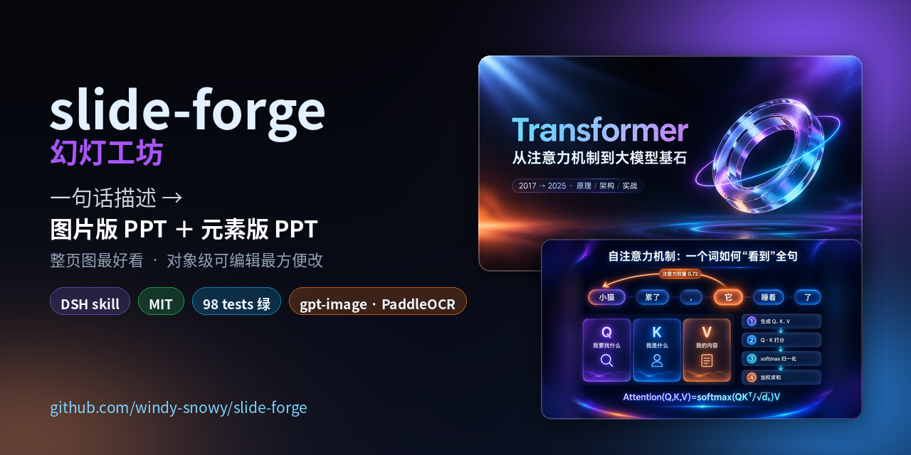

# slide-forge · 幻灯工坊

**中文** | [English](README.en.md)

> 一句话描述 → 两份 PPT：**图片版**（整页图，最好看）+ **元素版**（对象级可编辑，最好改）

[](https://github.com/windy-snowy/slide-forge/actions/workflows/ci.yml)




---

## 这是什么

你只需要说一句：

> 做一份给大学生讲 Transformer 的 10 页技术分享 PPT，深色科技风、玻璃拟态，用于课堂分享，约 20 分钟

slide-forge 会：

1. 把这句话**规格化**成一份可复现的 `deck_spec.json`（风格锁定 + 逐页提示词），缺什么补什么；
2. 用你选的生图模型**逐页出图**，过**质量闸门**（16:9 / 空白 / 重复 / 中文保真度），给你一张总览图确认；
3. 交付两份：

| 产出 | 叫什么 | 形态 | 什么时候用 |
| --- | --- | --- | --- |
| 视觉稿 | **图片版** | 每页一张整页 16:9 高清图 → `PPTX`（含讲者备注）+ `PDF` | 分享、投屏、发群、发小红书 |
| 可编辑稿 | **元素版** | 每页的文字/形状/图片都是独立对象 → 可编辑 `PPTX` | 需要改字、换色、补内容 |

> 为什么叫「元素版」？因为它是**元素级可编辑**的：标题能选中、卡片能拖动、图标能替换，
> 不是一张盖在整页图片上的假文字。它由 [`ningzimu/image-to-editable-ppt-skill`](https://github.com/ningzimu/image-to-editable-ppt-skill) 重建，
> slide-forge 负责编排与交付。

## 特性

- **一段描述就能开工**：页数、风格、受众、用途、时长缺了会按默认值落，不来回追问；
- **四种风格预设**：极光玻璃拟态（深色科技）/ 现代商务简约（默认）/ 学术汇报 / 活力营销，
  按描述里的关键词自动路由，也可以自己加预设；
- **多种生图模型**：OpenAI 兼容（gpt-image 系列）、OpenRouter（原生 16:9）、
  `chat/completions` 出图中转站、以及复用 `editppt` 配置的 CLI 后端；
- **质量闸门**：尺寸 / 16:9 / 空白 / 跨页重复（dHash）/ 中文文本保真度（百度飞桨 OCR），
  不合格自动重抽，并产出 `contact-sheet.png` 给人确认；
- **讲者备注**：每页 3–4 句口语讲稿，写进 `PPTX` 的 notes，也会带进元素版；
- **子代理模式可选，默认关闭**：想更快就说「用子代理模式」，元素版会并行派 page worker；
- **不编事实**：材料里没有的数据一律写 `【待补】`，不会替你编数字。

## 安装

### 作为 DSH 技能

```bash
git clone https://github.com/windy-snowy/slide-forge.git ~/slide-forge
cd ~/slide-forge && ./install.sh            # 软链到 ~/.dsh/skills/slide-forge
# 其他 agent：
#   ./install.sh --target ~/.claude/skills
#   ./install.sh --copy                   # 不支持软链时
```

装完在新会话里说「用 slide-forge 做一份 …… 的 PPT」即可。

### 直接用命令行

```bash
cd ~/slide-forge
python3 -m pip install Pillow numpy python-pptx        # python-pptx 只在组装 PPTX 时需要
python3 scripts/deck.py doctor
```

### 配置密钥

| 用途 | 环境变量 | 或写进 |
| --- | --- | --- |
| 生图 | `SLIDEFORGE_IMAGE_API_KEY` / `OPENAI_API_KEY` / `OPENROUTER_API_KEY` | `~/.slideforge/config.json` |
| 生图地址 | `SLIDEFORGE_IMAGE_BASE_URL` / `OPENAI_BASE_URL` | 同上 |
| OCR（可选但强烈建议） | `PADDLE_OCR_TOKEN` | `~/.editppt/config.yaml`（`editppt config --paddle-ocr-token <token>`） |

> 已经配好 [`editppt`](https://github.com/ningzimu/image-to-editable-ppt-skill) 的机器会自动复用它的
> key / base_url / model，不用再配一遍。

## 快速开始

```bash
SF=~/slide-forge

# 0) 自检
python3 $SF/scripts/deck.py doctor

# 1) 描述 → 规格 + 提示词（先看渲染结果）
python3 $SF/scripts/deck.py all "给大学生讲 Transformer，科技风，3 页，课堂分享" --until render --print-first

# 2) 出图（先看提示词，再真实调用）
python3 $SF/scripts/deck.py gen  --spec deck-runs/<run>/deck_spec.json --out-dir deck-runs/<run> --dry-run
python3 $SF/scripts/deck.py gen  --spec deck-runs/<run>/deck_spec.json --out-dir deck-runs/<run> \
        --only 1,2,3 --quality low --concurrency 3

# 3) 质检 → 看总览图确认
python3 $SF/scripts/deck.py qa   --out-dir deck-runs/<run>

# 4) 图片版 PPTX + PDF
python3 $SF/scripts/deck.py pptx --out-dir deck-runs/<run>

# 5) 元素版（默认不使用子代理）
python3 $SF/scripts/editable_run.py prepare --spec deck-runs/<run>/deck_spec.json
#    逐页：prompt → dispatch --local → 按 worker prompt 重建 → record → finalize
python3 $SF/scripts/editable_run.py merge   --spec deck-runs/<run>/deck_spec.json
```

一条命令跑到底（会在质检后停下等你确认）：

```bash
python3 $SF/scripts/deck.py all "…你的描述…" --until qa
```

## 两种元素的区别（什么时候选哪个）

| | 图片版 | 元素版 |
| --- | --- | --- |
| 画质 | ★★★★★ 设计稿级别 | ★★★☆ 由图片重建，可能有轻微误差 |
| 可编辑 | 只能整页换 | 文字/形状/图片逐个可改 |
| 速度 | 快（N 次出图） | 慢（每页一次对象级重建） |
| 费用 | 出图费 | 出图费 + 资产分离费 |
| 适合 | 分享、投屏、存档 | 需要二次修改、要交给别人改 |

**建议顺序**：先出图片版并确认，再产元素版——改风格在图片阶段最便宜。

## 风格预设

| 预设 | 视觉 | 适合 |
| --- | --- | --- |
| `aurora-glass` | 深色虚空 + 极光渐变 + 玻璃拟态 | 技术分享、AI/工程、产品发布 |
| `clean-corporate`（默认） | 白底 + 深蓝 + 克制留白 | 工作汇报、方案评审、培训 |
| `academic-paper` | 米白 + 低饱和 + 衬线标题 | 论文答辩、组会、研究综述 |
| `vivid-marketing` | 高对比大字 + 强色块 | 活动策划、招商路演、品牌提案 |

在 `references/presets/` 里加一个 JSON 就能新增预设；`keywords` 决定自动路由能否命中。

## 子代理模式（默认关闭）

默认**不使用**子代理：元素版会逐页重建后合并成一份 PPTX。

说了「用子代理模式 / 并行加速」之后：

```bash
python3 scripts/editable_run.py prepare --spec <run>/deck_spec.json --subagents --page-worker-concurrency 3
python3 scripts/editable_run.py next --run <run>/editable/run
```

加速策略（细节见 `references/subagent-strategy.md`）：

- 生图阶段用**进程内并发**（`--concurrency`），不派子代理——每页只是一次 HTTP 调用；
- 元素版按 `K = min(3, 剩余页, 并发上限)` 开槽，**无栅栏流水线**：谁先返回就立刻 record 并补派下一页；
- 每页只跑一次 `editppt prepare`（OCR hints 共享），worker prompt 自动追加效率附录
  （原生形状优先、资产合并 ≤2 张 sheet、页内图像任务串行）；
- 命中 429 就降到 K=2 并把质量档位降一档，不重启已派出的 worker。

## 实测数据

3 页真实小样（`gpt-image-2`，`size=1536x1024`，`fit=auto`，`--concurrency 3`，`--quality low`）：

| 环节 | 实测 |
| --- | --- |
| 出图 | 3/3 成功，墙钟 **56 秒**（单页 36.7–56.0s，并发 3） |
| 16:9 适配 | 2 页原生已接近 16:9（1672×940）无需处理；1 页内容偏高走**模糊羽化补边**（1820×1024），内容零损失 |
| 质检 | 通过 2 / 警告 1 / 不合格 0；OCR 后端 `paddleocr-vl`，文本匹配率 0.851 / 0.48 / 1.0 |
| 图片版 | `PPTX` 4.1MB（3 页满版图 + 逐页讲者备注 34/52/18 字）、`PDF` 0.5MB |

元素版（同 3 页，`--subagents`，K=3 无栅栏流水线）：

| 环节 | 实测 |
| --- | --- |
| 页面重建 | **3/3 通过**（每页 2–3 次图像任务）；派发到全部 record 约 1h18m |
| 元素版 `PPTX` | 3 页 **62 个形状 / 26 个可独立选中的文本框 / 12 张图片**，逐页备注保留；上游 `validate_pptx.py` `passed: true` |
| 合并路径 | 用同 3 页真实产物跑默认（单页 run + 合并）路径，同样 `passed: true` / 3 页 / 3 条备注 |
| 如实记录的降级 | 运行时不支持渐变/Alpha 填充 → 卡片与标题渐变用纯色近似；部分光晕为位图 |

那 1 页「警告」的复核结论：**画面文字逐字正确**。模型把 `它指向小猫，权重 0.72` 这句
用「一条标注 0.72 的弧线」表达，而不是渲染成一行文字，所以 OCR 匹配率只有 0.48。
这正是闸门把它标成 `warn`（值得人看一眼）而不是 `fail` 的原因——
文本匹配率只能定位「可疑页」，最终判断权在人。

## 仓库结构

```
slide-forge/
├── SKILL.md                 # DSH 技能入口
├── scripts/                 # deck.py / spec_model.py / img_providers.py / qa.py / editable_run.py / merge_pages.py
├── prompts/                 # 描述→规格、page worker 效率附录
├── references/              # 规格契约、模板、模型、OCR、元素版契约、子代理策略、风格预设
├── docs/                    # PUBLISH-TO-GITHUB.md / workflow.md / faq.md
├── tests/                   # 77 个单元测试（不联网、不花钱）
└── examples/transformer-glass/   # 旗舰示例：spec + 提示词 + 10 页图 + 总览
```

## 文档

- [如何上传 GitHub](docs/PUBLISH-TO-GITHUB.md) —— 面向第一次发开源仓库的人
- [工作流与状态机](docs/workflow.md)
- [FAQ 与已知限制](docs/faq.md)
- [验证记录](docs/verification.md) —— 实测过的与没实测的（含证据）
- [风格预设格式](references/spec-format.md) / [提示词模板](references/prompt-template.md)
- [生图后端与模型](references/image-models.md) / [OCR 配置](references/ocr.md)
- [元素版流程契约](references/editable-pipeline.md) / [子代理加速策略](references/subagent-strategy.md)

## 依赖

- Python 3.8+
- `Pillow`、`numpy`（图像指标与 16:9 适配）、`python-pptx`（组装 PPTX，可选）
- 生图 API（必需）
- 可选：[`editppt`](https://github.com/ningzimu/image-to-editable-ppt-skill)（元素版必需）、
  LibreOffice `soffice`（导出 PDF）、百度飞桨 PaddleOCR token（文本保真度检测）

## 许可

MIT，见 [LICENSE](LICENSE)。
