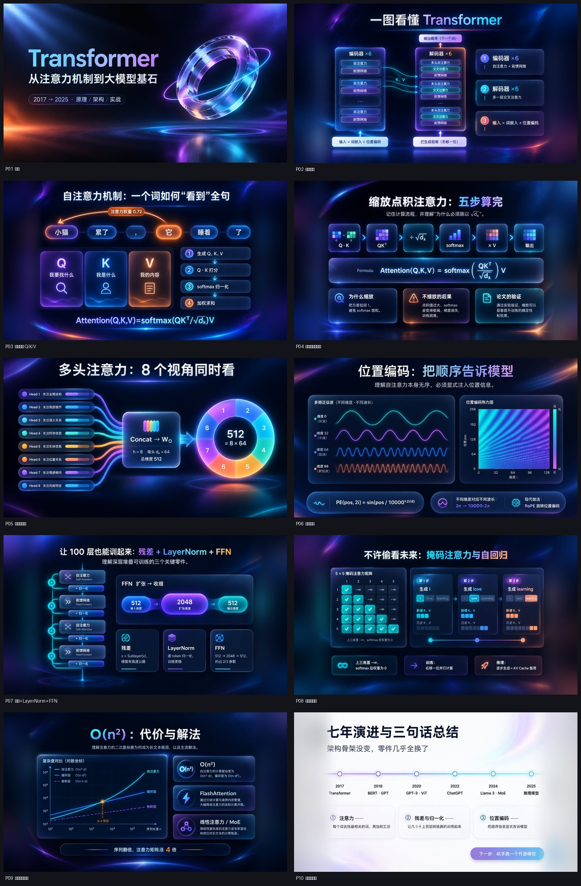

# 示例：Transformer 深色玻璃拟态（10 页）

这是 slide-forge 的旗舰示例：**一句描述 → 10 页图片版 PPT → 元素版 PPT**。

## 输入

> 做一份给大学生讲 Transformer 的 10 页技术分享 PPT，深色科技风、玻璃拟态，用于课堂分享，约 20 分钟

## 产物

| 文件 | 说明 |
| --- | --- |
| `deck_spec.json` | 完整规格：10 页的标题、目标、核心文字、版式、视觉元素、讲者备注 |
| `风格锁定与每页提示词.md` | 从 spec 渲染出的风格锁定表 + 全局风格块 + 逐页提示词 + 执行记录 |
| `prompts/page-01.md … page-10.md` | 实际发给生图模型的完整提示词（全局风格 + 构图安全区 + 页块 + 画幅） |
| `images/p01.jpg … p10.jpg` | 出图结果缩略图（原图为 1536×1024 出图后适配 16:9，此处压到 1280px 入库） |
| `contact-sheet.jpg` | 全部 10 页的总览图，质检时要给用户看的就是这张 |



## 怎么复现

```bash
cd <repo>
python3 scripts/deck.py spec render --spec examples/transformer-glass/deck_spec.json \
    --out-dir /tmp/tf-run
python3 scripts/deck.py gen   --spec /tmp/tf-run/deck_spec.json --out-dir /tmp/tf-run --dry-run
# 确认提示词没问题后真实出图（会产生费用）
python3 scripts/deck.py gen   --spec /tmp/tf-run/deck_spec.json --out-dir /tmp/tf-run --quality low
python3 scripts/deck.py qa    --out-dir /tmp/tf-run
python3 scripts/deck.py pptx  --out-dir /tmp/tf-run
```

元素版（默认不使用子代理）：

```bash
python3 scripts/editable_run.py prepare --spec /tmp/tf-run/deck_spec.json
# 逐页 prompt → dispatch --local → 重建 → record → finalize
python3 scripts/editable_run.py merge --spec /tmp/tf-run/deck_spec.json
```

想要单文件原生多页、并且更快：给 `prepare` 加 `--subagents`。

## 这份示例说明了什么

1. **规格是可读可改的**：想换视觉只改 `preset`，想改文案只改 `pages[i].core_text`，
   重跑 `spec render` 提示词同步更新。
2. **风格锁定真的有效**：10 页共用同一份全局风格块与负向约束，所以深色基底、极光强调色、
   玻璃卡片、右上角留白在 10 页里保持一致。
3. **提示词是"可直接投喂"的**：`prompts/page-NN.md` 里的内容粘到任何支持中文的生图模型都能重出一版。
4. **质检是有依据的**：`core_text` 就是 OCR 回读比对的基准——

   > 这也是为什么 `core_text` 要写成 3–4 条、每条 ≤20 字：太长会拖低 OCR 匹配率，
   > 太短又不足以判断画面文字是否正确。

5. **模型会改写标题用词**——这是真实现象，不是 bug。举例：

   | | 文字 |
   | --- | --- |
   | spec 第 3 页标题 | `自注意力：每个词都在“看”别的词` |
   | 实际出图标题（OCR 回读） | `自注意力机制：一个词如何“看到”全句` |

   语义不变、用词被精简。所以 QA 把这类页标成 `warn`（值得人看一眼）而不是 `fail`；
   想让标题**逐字**出现，要把它写进 `core_text` 并在 `negative` 里加 `不要改写标题用词`。
   详见 [docs/faq.md](../../docs/faq.md)。

## 原素材出处

原始 10 页由 `gpt-image-2`（OpenAI 兼容中转站）逐页生成，
出图尺寸 1536×1024、`quality=low`，再按 `fit=auto` 适配 16:9；中文逐字校验通过。

仓库首页的社交预览图（`assets/social-preview.png`，1280×640）就是用这里的
`images/p01.jpg` 与 `images/p03.jpg` 拼的。
